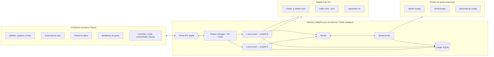

# Visão de produto — executor de plano desktop

> Status: **aprovado** (2026-10-06). Decisões das perguntas abertas e plano de execução em
> [superpowers/plans/2026-10-06-desktop-executor.md](superpowers/plans/2026-10-06-desktop-executor.md).
>
> Este documento substitui a identidade "control plane autônomo / laboratório"
> descrita em [ARCHITECTURE.md](ARCHITECTURE.md) e [ADR-0003](adr/ADR-0003-control-plane-identity.md)
> **para o produto novo**. O control plane antigo continua no repo, congelado,
> como referência.

---

## 1. O que o produto é

Um app desktop (**Electron + React**, layout parecido com o Claude Code Desktop)
que executa um plano aprovado, step a step, usando as CLIs de assinatura do
usuário (`claude -p`, `codex exec`, `opencode run`).

Ele automatiza o fluxo manual de "continuar em outro chat": **cada step roda
numa sessão NOVA da CLI**, recebendo um handoff curto:

- `plan.md` (o plano inteiro, com o step corrente marcado);
- `git diff` do que mudou desde o início do plano (ou do último step, quando
  o diff completo for grande);
- a nota curta que o step anterior deixou.

Continua sendo um **orquestrador**: ele escolhe modelo, lança processo, roda o
gate do projeto, faz retry, commita e anda para o próximo step. Ele não é um
laboratório: A/B, baterias, arms, score e Capability Matrix saem do produto.
Fica só o **ledger de custo** (tokens, modelo e tempo por step, em SQLite).

### Por que um core novo

O Lab atual trava em quase qualquer projeto. A causa é estrutural, não um bug:
~45 mil linhas em `dev/lib` (104 arquivos, 15 deles de
recovery/incident/adopt/revalidate), registros write-once, gates humanos,
base-guard e auditoria de processo transformam qualquer desvio em
`HUMAN_REQUIRED`. O produto novo precisa de pouca cerimônia: **em falha,
retry ou pausa — nunca um gate novo.**

---

## 2. Decisões aprovadas

| Tema | Decisão |
| --- | --- |
| Plataforma | Linux (Fedora) primeiro |
| Execução | CLIs com assinatura, não APIs. Perfis `metered_api` (OpenRouter) ficam fora do roteamento automático |
| Quota na UI | janelas Claude 5h e 7d, OpenAI (primary/semanal), OpenCode Go (rolling/weekly/monthly), cada uma com horário de reset |
| Modo de permissão | `Plan` / `Edit` / `Auto` |
| Continuidade | `Step a step` / `Por fase` / `Contínuo`, mais **Pausar** sempre visível (termina o step corrente e para). Trocável com o loop rodando |
| Planejamento | chat em modo Plan com modelo premium escreve `plan.md` (fases, steps, tier); usuário edita e aprova; então o loop começa |
| Router | planner marca o tier de cada step (`economy` / `standard` / `premium`); router escolhe o modelo do tier com mais folga e, se o provider esgotar, cai para outro provider do mesmo tier |
| Verificação | comando de gate do projeto (test/typecheck) + relato do agente. Em falha, retry com o erro no contexto até N vezes |
| Git por projeto | `Direto` (commit na branch atual; push opcional, inclusive para main, desligado por padrão e com aviso), `Branch` (padrão, branch por plano), `Worktree` (worktree isolada por plano) |
| Paralelismo | um loop por projeto, vários projetos ao mesmo tempo. Exige **quota broker** central |
| MVP | um projeto real concluído do início ao fim pelo app |

Os dois eixos são independentes. Exemplo: `Auto` + `Step a step` executa sem
pedir permissão de ferramenta, mas para depois de cada step para o usuário
olhar.

---

## 3. Componentes



| Componente | Responsabilidade | Não faz |
| --- | --- | --- |
| **UI (renderer)** | sidebar de projetos/loops, transcript do step corrente, plano com checkboxes, medidores de quota com reset, controles de modo/continuidade/Pausar | não toca processo, git nem disco; só fala por IPC |
| **Main / daemon** | dono único do estado vivo: loops, broker, ledger. Um processo por máquina | não renderiza |
| **Loop runner** | um por projeto. Lê `plan.md`, pega o próximo step, pede rota, monta handoff, lança a CLI, roda gate, retry, commit, marca o checkbox, decide parar conforme continuidade | não decide modelo, não lê quota direto |
| **Router** | função pura: `(tier, catálogo, snapshot de quota, providers excluídos) -> perfil` | não lança nada, não persiste nada |
| **Quota broker** | observa os pools (probe fresco), mantém **leases** de execução em curso por pool, entrega snapshot ao router e registra delta antes/depois no ledger | não inventa número; não bloqueia por folga baixa |
| **Ledger SQLite** | projetos, planos, steps, tentativas, tokens, modelo, duração, quota antes/depois | não é evidência write-once; é tabela mutável comum |
| **Adapters de CLI** | montar argv/env/stdin por (scaffold, modo de permissão) e decodificar o stream em eventos de transcript + tokens + falha terminal | não fazem spawn; spawn/kill é do loop runner |

### 3.1 Quota broker e a lição "medida só vale para a decisão que a observou"

[LESSONS.md](LESSONS.md) (2026-08-28, `effectiveQuotaHeadroom`) proíbe usar
número de quota de outra atividade como capacidade atual. O broker respeita
isso assim:

- **Antes de cada rota**, o broker faz probe fresco dos pools candidatos
  (um por pool, deduplicado). Esse é o único número de capacidade.
- **"Reservar e debitar"** é contabilidade de **concorrência**, não de
  capacidade: o broker conta quantos steps estão rodando agora em cada pool
  (leases). Com dois loops no mesmo pool, o router usa esse contador para
  espalhar carga entre providers do mesmo tier. Ele nunca subtrai um
  "custo previsto" do percentual observado nem trata o resultado como fato.
- Lease é liberado no fim do step; o delta observado (antes/depois) vai para o
  ledger como histórico de consumo, nunca como capacidade futura.
- `UNKNOWN` continua `UNKNOWN`; só `EXHAUSTED` declarado pelo provider (ou
  `remaining 0` em janela viva) remove um pool.

Teto de leases por pool: configuração opcional, sem teto por padrão
(decisão Q3).

---

## 4. Formato do `plan.md`

Arquivo no repositório alvo (caminho configurável, padrão
`.asl/plan.md`). O usuário edita à mão; o loop só muda checkboxes e a linha de
nota.

```markdown
# Plano: <título>

## Fase 1 — <nome>
- [ ] 1.1 [standard] <título do step>
  <descrição livre, critérios de aceite>
- [ ] 1.2 [economy] <título>

## Fase 2 — <nome>
- [ ] 2.1 [premium] <título>
```

- Tier entre colchetes logo após o id; ausente = `standard`.
- `- [x]` = concluído; `- [!]` = falhou após N retries (loop pausa).
- Nota do step anterior fica no ledger e entra no handoff; não polui o
  `plan.md`.

---

## 5. Reaproveitamento — o que entra no core novo

Regra: o core novo **copia** (porta) os arquivos escolhidos para
`packages/core`, com cabeçalho apontando a origem. Ele **não importa** `src/`
nem `dev/`. Motivo: o código antigo está congelado e puxa grafo grande
(`dev/lib/schemas.ts` tem 3677 linhas; `src/routing/router.ts` puxa
`planner`, `intake`, `inspection`). Cópia mantém o core pequeno e permite
cortar o que não serve sem tocar o antigo.

Dependências verificadas pelas linhas `import` de cada arquivo em 2052cca.

| Módulo | Veredito | Dependências que puxa | O que entra / o que sai |
| --- | --- | --- | --- |
| `src/providers/identity.ts` (278 l.) | **como está** | só `zod` | `ExecutionScaffold`, `UpstreamProvider`, `AuthMethod`, `BillingMode`, `QuotaPool`, `PROVIDER_CONTRACTS`, `providerIdentityOf`, `sharesQuotaPool`, `requiresExplicitSpendAuthorization`. Invariantes auth≠billing e scaffold≠provider≠pool continuam valendo |
| `src/quota/observation.ts` (388 l.) | **como está** | só `zod` | `PoolCapacityObservation`, `CapacityStatus`, `CapacityWindow` (já tem `resets_at` ISO), `unknownCapacity`, `windowDeltas`, `poolUnavailable` |
| `src/quota/probes.ts` (428 l.) | **como está** | `observation`, `credentials` | `probeOpenAiSubscriptionQuota` (`chatgpt.com/backend-api/wham/usage`), `probeOpenCodeGoQuota`, `anthropicCapacityOf`. `probeOpenRouterBalance` fica, mas só para exibição (OpenRouter é metered) |
| `src/quota/credentials.ts` (253 l.) | **como está** | `node:*` | `SealedCredential`, loaders por caminho, `sameChatGptAccount`. Segredo nunca sai do objeto |
| `dev/lib/claude-usage.ts` (528 l.) | **adaptar** | tipos de `dev/lib/schemas.ts` (só `import type`) | entra: `claudeUsageArgv`, `spawnUsageRunner`, `parseClaudeUsageText`, `zeroInferenceViolations`, `probeClaudeUsage`, `parseResetLabel`. Sai: `buildSubscriptionUsage`/`matchResetLabels` (medição antes/depois do LaunchRecord). Tipos `SubscriptionUsage*` viram tipos locais |
| `src/adapters/claude/quota.ts` (352 l.) | **descartar** | `src/schemas` | duplicata do `/usage` acima; só `src/experiment/pilot-launch.ts` usa |
| `dev/lib/pool-capacity-observer.ts` (186 l.) | **adaptar** | `src/quota`, `src/providers`, `claude-usage`, `doctor.ts` (`experimentFactsOf`), `paths.ts` (`HarnessPaths`), `profile.ts` (`LauncherProfile`, `buildEnvironment`) | vira a camada de probe do broker, indexada por pool. Fica: fallback OpenAI Codex→OpenCode só com `sameChatGptAccount`, dedupe por pool, falha → `UNKNOWN`. Saem as três dependências do harness |
| `dev/lib/claude-stream.ts` (401 l.) | **adaptar** | `canonical.ts` (`sha256Hex`, trivial) | entra: `readClaudeStream`, `readClaudeJsonResult`, `providerTerminalFailure`, observações `rate_limit_event`. Sai: introspecção de argv (`claudeOutputFormat`, `usesClaudeStreamJson`) e `rateLimitWindowDeltas` |
| `dev/lib/codex-transport.ts` (151 l.) | **como está** | `canonical.ts`, tipo de `claude-stream` | `decodeCodexEventStream`, `codexProviderTerminalFailure` |
| `dev/lib/opencode-scaffold.ts` (445 l.) | **adaptar** | tipo `UpstreamProvider` | entra: `openCodePermissionFor`/`openCodePermissionEnv` (viram a base dos modos Plan/Edit/Auto no OpenCode), `decodeOpenCodeRunStream`, `openCodeRunUsageOf`, `parseOpenCodeModel`. Roles `planner/implementer/reviewer` viram modos |
| `dev/lib/worker-token-usage.ts` (148 l.) | **como está** | `opencode-scaffold` | `claudeObservedTokens`, `codexObservedTokens`, `observedWorkerTokens` → alimentam o ledger |
| `src/routing/capability.ts` (445 l.) | **descartar** (ideia fica) | `src/providers`; espelha `doctor.ts`/`execution-policy.ts` | fica só o conceito de `CapabilityPrior` (tier + rank de custo), que vira campo do catálogo de modelos. Ownership, roles, `Determinable` saem |
| `src/routing/router.ts` (911 l.) | **descartar** (regras ficam) | `src/planner`, `src/intake`, `src/inspection` | saem tier por regex de nome de modelo, forecast, `ExecutionAssessment`. Ficam as regras de `QuotaHeadroom`: só `EXHAUSTED` remove; `UNKNOWN` não desempata; folga baixa é preferência |
| `src/adapters/events.ts` (60 l.) | **como está** | só `zod` | `AgentEvent` (message, tool_call, tool_result, result) = modelo do transcript |
| `src/adapters/contract.ts` (89 l.) | **adaptar** | tipos de `src/billing`, `src/credentials`, `src/envelope` | fica a forma pura `buildInvocation` + `parseLine`; sai `preflight`, `ExecutionEnvelopeManifest`, `executionKind` |
| `src/adapters/claude/*`, `codex/*` (invocation + parser) | **adaptar** | `src/schemas` (`EnvironmentProfile`), `src/storage/redaction.ts` (`redactString`, sem imports — portável), `src/credentials` | parsers ficam quase iguais; invocation passa a montar argv a partir do catálogo + modo de permissão |
| `src/adapters/registry.ts` (25 l.) | **como está** (padrão) | adapters | ganha `opencode`, que hoje só existe em `dev/lib` |
| `dev/profiles/*.yaml` | **dados** | — | argv já verificados viram semente do catálogo: `--no-session-persistence`, `--strict-mcp-config`, `--setting-sources project`, `--ephemeral`, `--ignore-user-config`; flags proibidas (`--resume`, `--bare`, `--dangerously-skip-permissions`) |
| `dev/lib/lab-projection.ts` (449 l.) | **referência** | `src/planner/plan-forecast.ts`, tipos de `lab-progress.ts` | ideia fica: redutor puro de eventos → snapshot de UI, e uma linha **por pool** (não por provider). Estados de task e forecast saem |
| `dev/lib/lab-tui.ts` (267 l.) | **descartar** | tipos de `lab-progress`/`lab-projection` | renderer de terminal; a UI vira React |
| `docs/PROVIDERS.md` | **referência viva** | — | §1–2, §5, §5.1, §6, §9, §10 continuam sendo as regras de provider e quota do produto novo |
| `docs/ARCHITECTURE.md` | **congelado** | — | descreve o control plane antigo |

### 5.1 O que fica congelado

Fora do caminho principal, sem edição, sem import a partir do core novo:

- todo `dev/lib` exceto os arquivos portados acima — em especial
  recovery/incident/adopt/revalidate, `project-preflight`, `doctor`,
  `execution-policy`, `schemas.ts`, records write-once, base-guard, process
  audit, `lab-progress`/`lab-tui`;
- `dev/cli/*` e os scripts `dev-*` / `lab` do `package.json` raiz;
- em `src/`: `planner`, `intake`, `inspection`, `routing` (resto),
  `experiment`, `strategies`, `evaluator`, `scorer`, `reporting`,
  `performance`, `envelope`, `storage` (exceto `redaction.ts`), `runner`,
  `workspace`, `billing`, `credentials`, `cli`, `project`, `schemas`, `core`;
- `corpus/`, `strategies/`, `fixtures/` (os fixtures de stream Codex podem ser
  copiados para os testes dos adapters novos).

Congelado = continua compilando e testando como hoje (`pnpm typecheck`,
`pnpm test` na raiz), mas nenhuma feature nova entra lá.

---

## 6. Princípios do core novo

1. **Pouca cerimônia.** Falha de step → retry com erro no contexto (até N).
   Esgotou N → `- [!]` no plano e o loop pausa. Nada de `HUMAN_REQUIRED`
   novo, grant, adoção ou revalidação.
2. **Limite só com causa real** (LESSONS 2026-08-27, "um limite só tem
   autoridade de execução se corresponder a uma restrição REAL"): o único
   teto de processo é um timeout de máquina por step, configurável.
3. **Quota observada, nunca inventada** (PROVIDERS §5–6).
4. **Assinatura, nunca API por acaso.** `--bare` proibido; perfis
   `metered_api` não entram no roteamento automático.
5. **Processo novo por step**, nunca `--resume`/`--continue`.
6. **Spawn com sessão própria e kill do grupo** (lições S04/S14: `detached`
   primeiro, matar o process group; tag de ambiente por step).
7. **Um dono de estado por projeto**: o loop runner do daemon. Daemon único
   por máquina (lock com pid + starttime, lição S10).
8. **Commit é do orquestrador**, como hoje: o agente edita; o loop commita
   depois do gate verde, conforme o Git mode.
